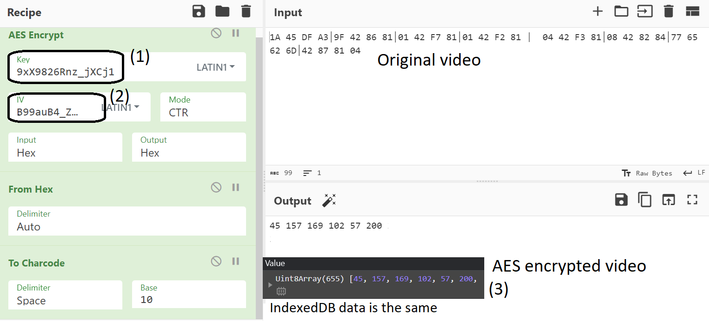
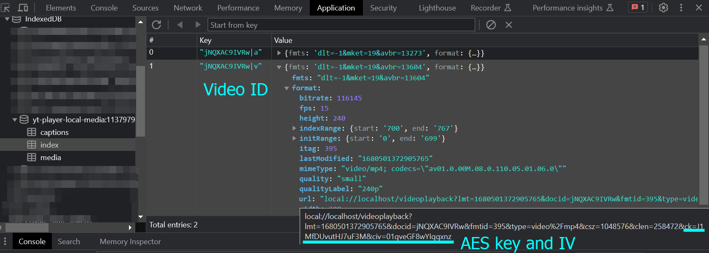
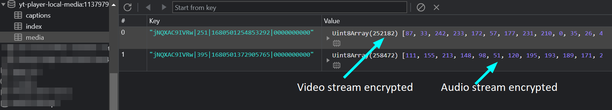

# Youtube Premium video downloader

## Motivation

Learning javascript. Thanks to [Mozilla Developer Network](https://developer.mozilla.org/en-US/docs/Learn/JavaScript/First_steps).

## Task

Youtube Premium has a very useful feature - download videos locally. But I wish the video download as a separate file, not somewhere in the browser.

## Reverse engineering youtube sources

Target logic contains in `base.js`, which is downloaded from youtube and executed in the browser.  Youtube download video and audio streams, encrypts them with AES, and save them in the browser's database known as IndexedDB.

The following data using for AES encryption:

1. AES key store inside IndexedDB database `yt-player-local-media:XXX||YYY` table called `index` under `url` value.
2. AES initialization vector stored in the same place.

3. Encrypted video stored as a byte array in the same database, but `media` table. 

## youtube-premium-download.js

My javascript attempt. According to the youtube logic, this script must do the following to extract the video:

1. Go to `index` table and extract the following information from `url`:
   * video id
   * format (audio or video)
   * last modified date (used for mapping with blobs in `media` table)
   * AES key
   * AES IV
2. Populate encrypted video blobs from table `media`
3. Decrypt blobs
4. Save locally

## POC demo

